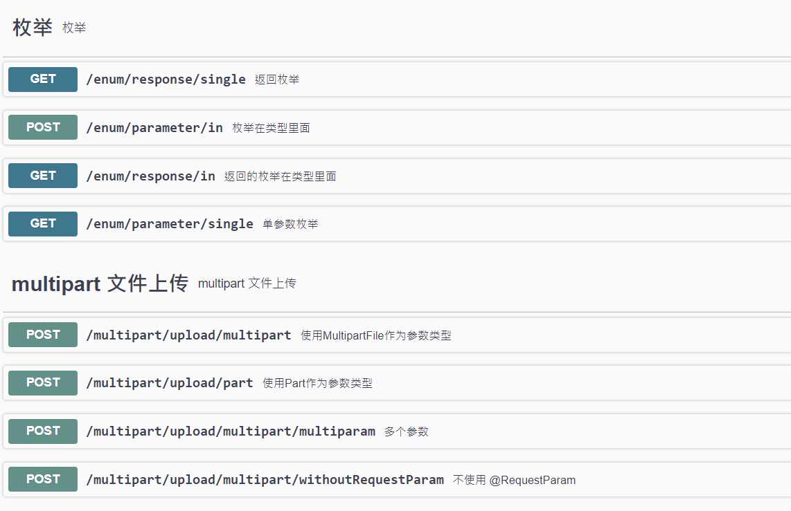

## 介绍

该项目用于在运行时使用javadoc生成swagger文档，并使用swagger-ui进行显示。




## 使用

第一步，配置pom，配置RestDocConfig

在SpringBoot中，增加依赖：

```
<dependency>
     <groupId>cn.willingxyz.restdoc</groupId>
     <artifactId>RestDocSpringSwagger3</artifactId>
     <version>0.1.0</version>
 </dependency>
```

对于JavaConfig，配置如下：

```java 
@Bean
RestDocConfig _swaggerConfig()
{
    return RestDocConfig.builder()
            .apiTitle("rest doc title")
            .apiDescription("rest doc desc")
            .apiVersion("api version")
            .fieldPrefix("_")
            .packages(Arrays.asList(""))
            .build();
}
```

其中 packages 表示要扫描的基础包名，如 `packages(Arrays.asList("cn.willingxyz.restdoc.springswagger3.examples"))`

其中 fieldPrefix表示字段前缀。
因为在获取javadoc时，会从field、get方法、set方法上获取，因此如果field有前缀，需要通过fieldPrefix设置，否则将无法获取到javadoc。
如：

```java
public class Response {
    /**
    * name javadoc
    */
    private String _name;
    public String getName() {
           return _name;
    }
    public void setName(String name) {
        _name = name;
    }
}
```

Name属性对应的字段是_name，因此 fieldPrefix应该设置为 `.fieldPrefix("_")`

第二步，在需要生成javadoc的项目中，增加如下依赖：

```
<!-- Annotation processor -->
<dependency>
    <groupId>com.github.therapi</groupId>
    <artifactId>therapi-runtime-javadoc-scribe</artifactId>
    <version>0.9.0</version>
    <scope>provided</scope>
</dependency>
```

启动应用后，打开 http://host/swagger-ui/index.html 浏览

具体可参考 RestDocSpringSwagger3Examples。

## 原理

通过注解处理器在编译时生成javadoc的json文件。
在运行时读取生成的javadoc文件。


